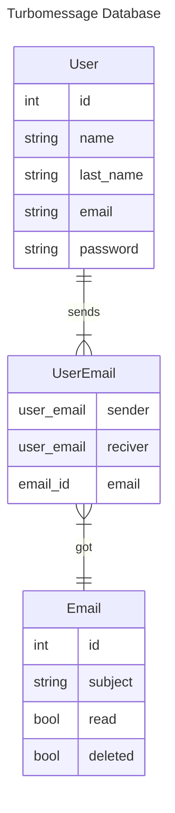

# proyecto_omega_sistemas_distribuidos

Proyecto Omega o proyecto turbomessage de la clase de sistemas distribuidos

- [proyecto\_omega\_sistemas\_distribuidos](#proyecto_omega_sistemas_distribuidos)
  - [Dependencias](#dependencias)
    - [Grpc](#grpc)
    - [Dearpygui](#dearpygui)
  - [Funcionalidad](#funcionalidad)
    - [Base de Datos](#base-de-datos)

## Dependencias

### Grpc

```bash
python -m pip install grpcio
python -m pip install grpcio-tools
```

### Dearpygui

``` bash
# Para poder manejar los gráficos
pip  install dearpygui
```

## Funcionalidad

### Base de Datos


